<h2>Elevare Ars 🚀</h2>


<p><strong>Elevare Ars</strong> is an AI-powered career exploration platform that bridges the gap between education and industry by connecting students with experienced professionals for mentorship, guidance, and hands-on learning opportunities.</p>

<p>
  <a href="https://github.com/Kingsoman/Elevare-Ars/stargazers">
    
  </a>
  <a href="https://github.com/Kingsoman/Elevare-Ars/network/members">
    
  </a>
  <a href="https://github.com/Kingsoman/Elevare-Ars/issues">
    
  </a>
  <a href="https://github.com/Kingsoman/Elevare-Ars/pulls">
    
  </a>
  <a href="LICENSE">
    
  </a>
</p>

<hr/>

<h2>🎯 Problem Statement</h2>
<p>
Students often struggle to understand real-world career paths and lack access to industry insights. Meanwhile, professionals want to give back but don’t have structured ways to mentor the next generation. <strong>Elevare Ars</strong> solves this disconnect.
</p>

<hr/>

<h2>✨ Key Features</h2>

<h3>👩‍🎓 For Students</h3>
<ul>
  <li><strong>Smart Matching Algorithm</strong> – AI-powered matching based on interests, skills, career goals, and learning preferences</li>
  <li><strong>Career Exploration Tools</strong> – Interactive career pathway mapping and skills gap analysis</li>
  <li><strong>Virtual Mentorship</strong> – In-app video calls, secure messaging, and structured mentorship programs</li>
  <li><strong>Project-Based Learning</strong> – Collaborate on real industry projects with mentor guidance</li>
  <li><strong>Skill Portfolio</strong> – Build and showcase digital portfolios with verified achievements</li>
  <li><strong>Goal Tracking</strong> – Set and monitor career development milestones</li>
</ul>

<h3>👨‍🏫 For Industry Professionals</h3>
<ul>
  <li><strong>Flexible Mentoring</strong> – Choose availability and mentoring style (1-on-1, group sessions, project-based)</li>
  <li><strong>Impact Dashboard</strong> – Track mentees’ progress and outcomes</li>
  <li><strong>Company Integration</strong> – Corporate mentorship programs and future talent pipeline building</li>
  <li><strong>Knowledge Sharing</strong> – Share industry insights, resources, and best practices</li>
  <li><strong>Professional Recognition</strong> – Build thought leadership and reputation within the platform</li>
</ul>

<h3>🛠 Platform Features</h3>
<ul>
  <li><strong>Safety First</strong> – Verified profiles, moderation, and secure communication</li>
  <li><strong>Analytics & Insights</strong> – Career trend analysis and skill demand forecasting</li>
  <li><strong>Multi-Modal Communication</strong> – Video, voice, text, and collaborative workspace tools</li>
  <li><strong>Mobile-First Design</strong> – Flutter apps for iOS, Android + Web (same codebase)</li>
  <li><strong>Integration Ready</strong> – APIs for schools, universities, and corporate systems</li>
</ul>

<hr/>
<h2>👐 Open Source &amp; Free</h2>
<ul>
  <li>Elevare Ars is completely free and open source.</li>
  <li>Community-driven: built by developers, designers, mentors, and students.</li>
  <li>Everyone can use it without cost.</li>
</ul>
<p><em>Future enhancements may come, but the core project will remain free and open source.</em></p>

<hr/>

<h2>🏞 Demo / Screenshots</h2>
<p align="center">
  
</p>
<p align="center">
  
  
</p>

<hr/>

<h2>🚀 How It Works (For Users)</h2>
<ol>
  <li><strong>Sign Up</strong> &rarr; Create a free account.</li>
  <li><strong>Discover Careers</strong> &rarr; AI suggests paths based on your interests and skills.</li>
  <li><strong>Skill Roadmap</strong> &rarr; Get a step-by-step learning plan with recommended resources.</li>
  <li><strong>Track Progress</strong> &rarr; Update your learning journey as you learn.</li>
  <li><strong>Find Mentors</strong> &rarr; Connect with experienced professionals.</li>
  <li><strong>Stay Updated</strong> &rarr; Receive reminders and alerts via FCM.</li>
</ol>
<hr/>
<h2>🛠 Tech Stack</h2>
<ul>
  <li><strong>Frontend &amp; Mobile:</strong> Flutter (Riverpod, Clean Architecture)</li>
  <li><strong>Backend:</strong> Supabase (Auth, PostgreSQL + RLS, Realtime, Storage, Edge Functions)</li>
  <li><strong>AI:</strong> Python microservices (FastAPI/Flask) for career matching, skills gap analysis, recommendations</li>
  <li><strong>Communication:</strong> WebRTC (calls), Supabase Realtime (chat), FCM (push notifications)</li>
  <li><strong>Infra:</strong> Supabase Cloud + Vercel, Docker for AI services, GitHub Actions (CI/CD)</li>
</ul>

<hr/>

<h2>⚙️ Installation / Setup</h2>
<ol>
  <li><strong>Clone the repository</strong>
    <pre><code>git clone https://github.com/Kingsoman/Elevare-Ars.git
cd Elevare-Ars</code></pre>
  </li>
  <li><strong>Install dependencies</strong>
    <pre><code>flutter pub get</code></pre>
  </li>
  <li><strong>Setup Supabase</strong>
    <ul>
      <li>Create a new Supabase project.</li>
      <li>Add your API keys to <code>.env</code> or secure config.</li>
      <li>Run schema migrations and enable RLS policies.</li>
    </ul>
  </li>
  <li><strong>Setup Firebase (for FCM)</strong>
    <ul>
      <li>Create a Firebase project and add Android/iOS/Web apps.</li>
      <li>Download <code>google-services.json</code> (Android) and <code>GoogleService-Info.plist</code> (iOS).</li>
      <li>Enable Cloud Messaging (FCM).</li>
    </ul>
  </li>
  <li><strong>Run the project</strong>
    <pre><code>flutter run</code></pre>
  </li>
</ol>

<hr/>

<h2>🗺 Roadmap</h2>
<ul>
  <li>[ ] AI-powered career recommendations</li>
  <li>[ ] Mentor matching system</li>
  <li>[ ] Project-based learning modules</li>
  <li>[ ] Push notifications (via FCM)</li>
  <li>[ ] Skill portfolio and progress dashboard</li>
  <li>[ ] Web + Mobile (Flutter responsive UI)</li>
</ul>

<hr/>

<h2>📛 Badges</h2>
<p>
  
  
  
</p>

<hr/>

<h2>🤝 Contribution</h2>
<p>We welcome contributions from developers, designers, mentors, and community members!</p>

<h3>🔄 Branch Workflow</h3>
<ul>
  <li><strong>main</strong> → Production branch (stable, always deployable)</li>
  <li><strong>develop</strong> → Active branch for new features & fixes</li>
</ul>

<h3>📌 Steps to Contribute</h3>
<ol>
  <li>Fork the repo</li>
  <li>Clone your fork
    <pre><code>git clone https://github.com/Kingsoman/Elevare-Ars.git
cd Elevare-Ars</code></pre>
  </li>
  <li>Checkout to develop branch
    <pre><code>git checkout develop</code></pre>
  </li>
  <li>Create a new feature branch
    <pre><code>git checkout -b feature/your-feature-name</code></pre>
  </li>
  <li>Commit & Push your changes
    <pre><code>git add .
git commit -m "Added [your feature]"
git push origin feature/your-feature-name</code></pre>
  </li>
  <li>Open a Pull Request → Merge into <strong>develop</strong></li>
  <li>Once reviewed, changes will merge into <strong>main</strong></li>
</ol>


<hr/>


## 🧪 Running Tests

Before pushing your changes, make sure all tests pass locally:

```bash
flutter test
```

<h2>📂 Project Structure</h2>

<p>The project follows a modular <strong>feature-first architecture</strong> using Flutter + Riverpod.</p>

<pre>
lib/
│
├── core/               # Global app config (theme, constants, helpers, widgets)
│   ├── theme/          # Colors, typography, dark/light themes
│   ├── utils/          # Helpers, validators, formatters
│   └── widgets/        # Reusable shared widgets (buttons, inputs, etc.)
│
├── features/           # Independent features (scalable, testable)
│   ├── auth/           # Authentication (login, signup, reset password)
│   ├── profile/        # User profile, settings
│   ├── mentorship/     # Mentor/mentee matching, session booking
│   └── career/         # Career roadmap, AI recommendations
│
├── services/           # External services integration
│   ├── supabase_service.dart  # Supabase (auth, DB, storage)
│   ├── fcm_service.dart       # Firebase push notifications
│   └── resend_service.dart    # Email delivery
│
├── providers/          # Riverpod providers (global state management)
│
├── app.dart            # Root app widget
└── main.dart           # Entry point

```mermaid
flowchart TD
  User[👩‍🎓 User] -->|UI Events| Flutter[📱 Flutter App]
  Flutter -->|API Calls| Supabase[(🗄 Supabase)]
  Flutter -->|Push Notifications| FCM[📢 Firebase Cloud Messaging]
  Flutter -->|Email| Resend[📧 Resend Service]
  Supabase -->|DB/Auth| Postgres[(🐘 PostgreSQL)]
  Flutter -->|AI Requests| AIService[🤖 AI Microservices]

```

</pre>

<h3>🖼 Architecture Overview</h3>



<hr/>

<h2>👥 Contributors</h2>
<p>Thanks goes to these wonderful people who make Elevare Ars possible 💜</p>
<p>
  <a href="https://github.com/Kingsoman/Elevare-Ars/graphs/contributors">
    
  </a>
</p>

<hr/>

<h2>📜 License</h2>
<p>Elevare Ars is released under the <strong>MIT License</strong>.</p>
